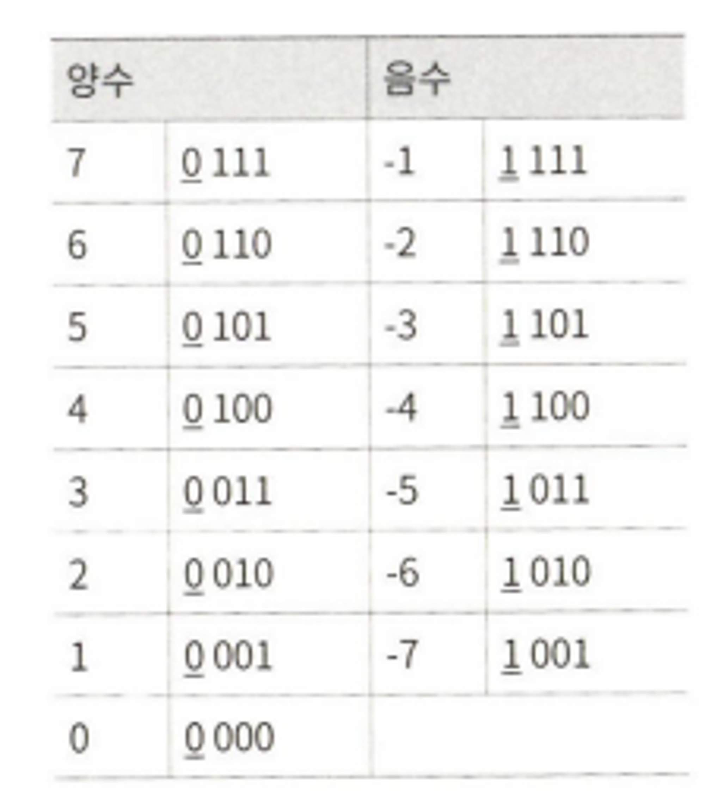

# 🐢 비트 연산 : 이론

## <mark style="background-color:orange;">**🫧 비트 조작**</mark>

: 0s 는 모든 비트가 0 인 값

: 1s 는 모든 비트가 1 인 값

: 연산들이 비트 단위로 이루어 진다!

: 한 비트에서 일어나는 일이 다른 비트에 어떤 영향도 미치지 않는다


## <mark style="background-color:orange;">**🫧 2의 보수와 음수**</mark>

: 컴퓨터는 일반적으로 정수를 저장할 때 2의 보수 형태로 저장

: 양수를 표현할 땐 문제 없음

: 음수를 표현할 땐 그 수의 절댓값에 부호비트를 1로 세팅한 뒤 2의 보수를 취한 형태로 표현함

: N비트 숫자에 대한 2의 보수는 2^N 에 대한 보수값과 같음 (N은 부호비트를 뺀 나머지 값을 표현할 때 사용되는 비트의 개수)

: 2의 보수를 표현하는 다른 방법은 양수로 표현된 2진수를 뒤집은 뒤 1을 더해 주는 것




## <mark style="background-color:orange;">**🫧 산술 우측 시프트 VS 논리 우측 시프트**</mark>

* 산술 우측 시프트
  * 기본적으로 2로 나눈 결과와 같음
* 논리 우측 시프트
  * 일반적으로 비트를 옮길 때 보이는 것처럼 움직임
  * 비트를 옆으로 옮긴 다음에 최상위 비트에 0을 넣는다 (>>> 연산)
  * 비트를 오른쪽으로 옮기긴 하지만 부호비트는 바꾸지 않는다


## <mark style="background-color:orange;">**🫧 기본적인 비트 조작 : 비트값 확인 및 채워넣기**</mark>

**💖 비트값 확인**

: 1 을 i 비트만큼 시프트에서 00010000와 같은 값 만들기

: AND 연산을 통해 num 의 i번째 비트를 뺀 나머지 비트를 모두 삭제한 뒤, 이 값을 0과 비교

: 이 값이 0이 아니라면 i번째 비트는 1, 0이라면 i번째 비트는 0이어야 함

```jsx
boolean getBit(int num, int i) {
	return ((num % (1 << i)) != );
}
```


**🧡 비트값 채워넣기**

: 1을 i비트만큼 시프트해서 00010000와 같은 값 만들기

: OR 연산을 통해 num의 i번째 비트값 바꾸기

: i번째를 제외한 나머지 비트들은 0과 OR 연산을 하므로 num에 영향 없음

```jsx
int setBit(int num, int i) {
    return num | (1 << i);
}
```


**💛 비트값 삭제하기**

: NOT 연산자를 이용해 00010000 을 11101111 와 같이 만든 뒤 num과 AND 연산

: 나머지 비트의 값은 변하지 않은 채 i 번째 비트값만 삭제됨

```jsx
int clearBit(int num, int i) {
	int mask = ~(1 << i);
	return num & mask;
}
```

: 최상위 비트에서 i번째 비트까지 모두 삭제하려면 (1 << i) 로 i번째 비트를 1로 세팅한 뒤 이 값에서 1을 뺀다

: i번째 비트 밑은 모두 1로 세팅되고 그 위로는 모두 0으로 세팅

: mask 값과 num을 AND 연산한다면 하위 i개의 비트를 뺀 나머지 비트를 모두 삭제 할 수 있음

```jsx
int clearBitMSBthroughI(int num, int i) {
	int mask = (1 << i) - 1;
	return num & mask;
}
```

: i 번째 비트에서 0번째 비트까지 모두 삭제하려면 모든 비트가 1로 세팅된 -1을 왼쪽으로 i + 1만큼 시프트 한다

: i번째 비트 위로는 모두 1로 세팅되고 하위 i개 비트는 모두 0으로 세팅됨

```jsx
int clearBitsIthrough0(int num, int i) {
	int mask = (-1 << (i + 1));
	return num & mask;
}
```


**💚 비트값 바꾸기**

: i번째 비트값을 v로 바꾸고 싶다면, 우선 11101111와 같은 값을 이용해 i번째 비트값을 삭제해야 함

: 바꾸고자 하는 값 v를 왼쪽으로 i번 시프트 한다

: i번째 비트값은 v가 될 것이고 나머지는 모두 0이 될 것이다

: 마지막으로 OR 연산을 이용해 i번째 비트값을 v로 바꿔준다

```jsx
int updateBit(int num, int i, boolean bitIs1) {
	int value - bitIs1 ? 1 : 0;
	int mask = ~(1 << i);
	return (num & mask) | (value << i);
}
```
